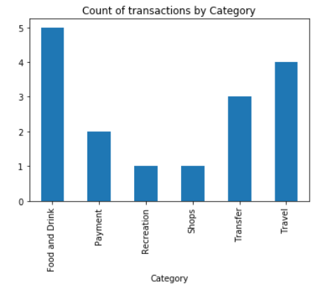
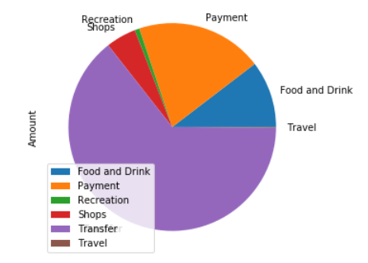
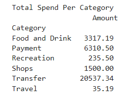
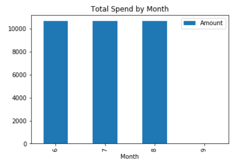
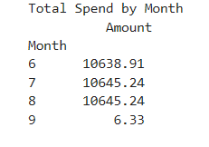
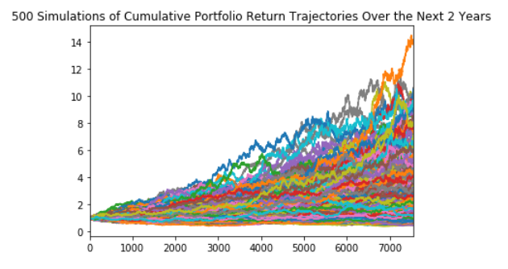
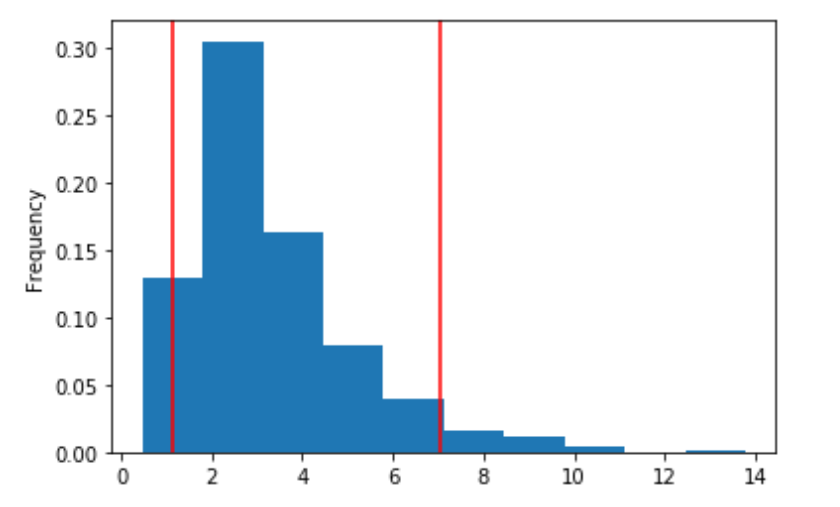

_Prepared by: Vinay Kakuru_  
_Class: Fintech Bootcamp @ Rice_

# Budget Analysis: 

For the budget analysis, I used Plaid API to fetch data from a  financial institute in the sandbox environment. Below are the charts produced from the transactions analysis over previous 90 days (June 2th, 2019 - September 1st, 2019):

## Transaction Count by Category  
  
### *Observations:*  
1. Food and Drinks category has the highest number of transactions (5), followed by travel (4) and transfers (3)
2. Recreation and Shops categories have the least amount of transactions  

## Transaction Amount by Category  
  
  
### *Observations:*  
1. Trasfer category has the highest amount to total spend ($20.5K+), while having only 3 transactions 

## Transaction Spend by Month  
  
  
### *Observations:*  
1. Seems like an auto-script is creating the transactions on a regular intervals. Therefore the spend across 3 months is $10,645. 

# Retirement Planning:

For the planning analysis, I used the IEX API to fetch historical closing prices `SPY` and `AGG` tickers, and created a traditional 60/40 portfolio using the  to represent the 60% stocks (SPY) and 40% bonds (AGG).

## Monte Carlo Simulation  
Then, I ran a Monte Carlo Simulation of 500 runs and 30 years for the portfolio. Below are the results for the simulation:

## Results of the Monte Carlo Simulation  

Percentile | Value
---|---
0.05|1.120475  
0.95|7.042014
90% confidence interval for the returns is between 1.12X and 7.04X.

## Results of $20K & $30K intial investment  
1. On the very low side (P0), initial investment of $20,000 in the portfolio over 30 years will yeild $29275.0
2. There is a 10% chance that portfolio over 30 years will yeild below $49849.0
3. There is a 50% chance that portfolio over 30 years will yeild below $76778.0
4. There is a 90% chance that portfolio over 30 years will yeild below $133397.0

## Comparing $20K & $30K intial investment to yearly income of $7,389
1. 4% draw from $20K investement's expected return at 10th percentile will not exceed projected yearly income of $7,389.
2. 4% draw from $30K investement's expected return at 10th percentile will not exceed projected yearly income of $7,389.

